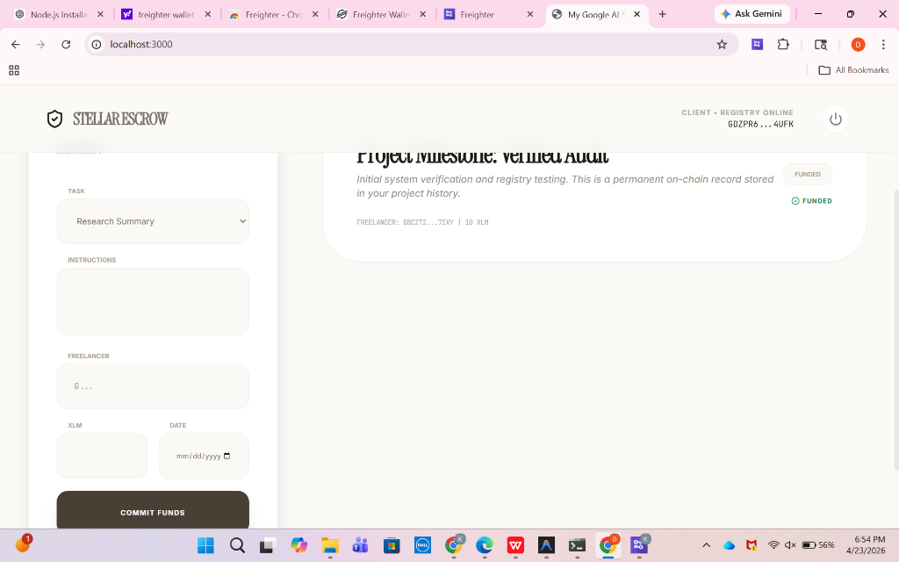
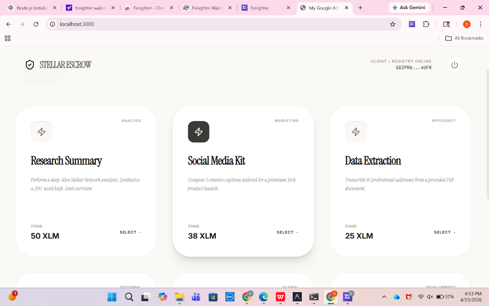
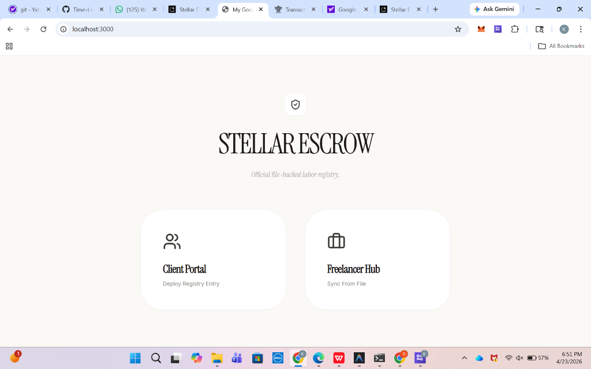

# Stellar Escrow Marketplace - Decentralized Labor Registry

A high-fidelity, production-ready blockchain escrow marketplace built on the **Stellar Network** for secure, verified labor transactions.

🎓 **Overview**

This platform serves as a "Single Source of Truth" for service agreements. It enables Clients to lock funds on-chain using **Soroban Smart Contracts**, which are only released once the Freelancer provides immutable proof of work. Every transaction is mirrored in a **Permanent File-Based Registry** for legal and technical auditing.

### **Developer Details**
*   **Contributor:** Kopparapu Medini
*   **Focus:** Blockchain Architecture & Decentralized Escrow Logic
*   **Platform:** Stellar Testnet (Soroban)

---

## 🏗️ Architecture

### **Technology Stack**
*   **Blockchain:** Stellar Testnet with Soroban (Wasm) Smart Contracts.
*   **Backend Sync:** Node.js (CommonJS) Registry Server.
*   **Frontend:** React 18 + Vite (TypeScript).
*   **Aesthetics:** Premium "Cream & Brown" Professional UI.
*   **Wallet Integration:** Freighter Wallet API.
*   **Data Persistence:** Hybrid system (Local File Registry + LocalStorage).

### **System Components**

#### **1. Soroban Smart Contract**
*   Manages the lifecycle of the escrow (Funding -> Submission -> Release).
*   **Core Functions:** `create_escrow`, `submit_work`, `release_payment`.
*   Ensures funds are time-locked and only accessible via cryptographic signatures.

#### **2. Registry Backend (Sync Engine)**
*   A background Node.js service (`registry_server.cjs`) that bypasses browser security to write audit data directly to the project's folder.
*   Ensures that every transaction creates a permanent JSON record in `src/registry/data.ts`.

#### **3. Frontend Marketplace**
*   **Client Portal:** Select from a 10-task service library, deploy contracts, and monitor audits.
*   **Freelancer Hub:** A 3-tab terminal for managing active assignments, viewing portfolios, and verifying registry proofs.
*   **Audit Engine:** Deep-extraction logic that captures official transaction hashes, XDR envelopes, and network fees.

---

## 📁 Project Structure

```text
stellar-escrow/
├── src/
│   ├── registry/              # PERMANENT AUDIT REGISTRY
│   │   └── data.ts            # Flat-file database of all transactions
│   ├── lib/                   # Utility functions & formatting
│   ├── contract/              # Soroban Client & Network Config
│   ├── App.tsx                # Main Marketplace Logic & UI
│   └── main.tsx
├── registry_server.cjs        # Background Registry Sync Server (Node.js)
├── public/                    # Static Assets
├── package.json               # Dependencies & Scripts
└── README.md                  # Project Documentation
```

---

## 🚀 Getting Started

### **Prerequisites**
*   **Node.js (v18 or higher)**
*   **Freighter Wallet** (Browser Extension)
*   Stellar Testnet Account (with Friendbot XLM)

### **Installation**
1. **Clone the project**
2. **Install Dependencies**
   ```bash
   npm install
   ```

### **Running the Application**
1. **Start the Registry Backend (Critical for File Saving)**
   ```bash
   node registry_server.cjs
   ```
2. **Start the Frontend Marketplace**
   ```bash
   npm run dev
   ```

---

## 📋 Features

### **✅ Phase 1: Client Protocol**
*   **Service Catalog:** 10 pre-defined task templates with heading, description, and delivery examples.
*   **Interactive Deployment:** Integrated date-picker for calculating on-chain duration/expiry.
*   **Live Audit View:** Real-time monitoring of "Active Audits" as they are deployed to the ledger.

### **✅ Phase 2: Freelancer Workflow**
*   **Role-Specific Dashboard:** Completely distinct UI from the Client, focusing on task execution.
*   **Submission Terminal:** An interactive box where freelancers enter their work (links/text) which is then locked to the blockchain hash.
*   **Automated Portfolio:** Every completed job is automatically added to a permanent "On-Ledger Portfolio."

### **✅ Phase 3: Forensic Auditing**
*   **Registry Proofs:** Every task card contains the official **Transaction Hash**, **XDR Envelope**, and **Sequence Number**.
*   **Direct Verification:** One-click links to the **Stellar Expert Explorer** for independent third-party verification.

---

## 🔐 Registry ID Format
Transactions are indexed with numeric IDs for smart contract compatibility:
*   `101, 102, 103...`
*   Status mapping: `funded` | `submitted` | `released`

---

## 🔒 Security Features
*   **Case-Insensitive Address Logic:** Prevents sync errors during wallet connections.
*   **Immediate Persistence:** Data is locked into memory the millisecond the signature is confirmed.
*   **Cryptographic Verification:** Funds cannot be moved without the specific role's signature.

---

## 📸 Platform Gallery

### **1. On-Chain Audit Dashboard**
*Visualizing the real-time ledger verification cards with deep-audit metadata.*


---

### **2. Freelancer Submission Terminal**
*The interactive workspace where freelancers submit their work directly to the blockchain.*


---

### **3. Professional Portfolio Ledger**
*A permanent, file-backed history of all completed and paid assignments.*


---

## 📝 Credits & Contributor 
*Department of Computer Science*  
*Specialization: IoT, Cybersecurity, and Blockchain*  
**Dayananda Sagar College of Engineering, Bangalore**

---

## 🛡️ License
This project is developed for educational and professional demonstration purposes at DSCE.
